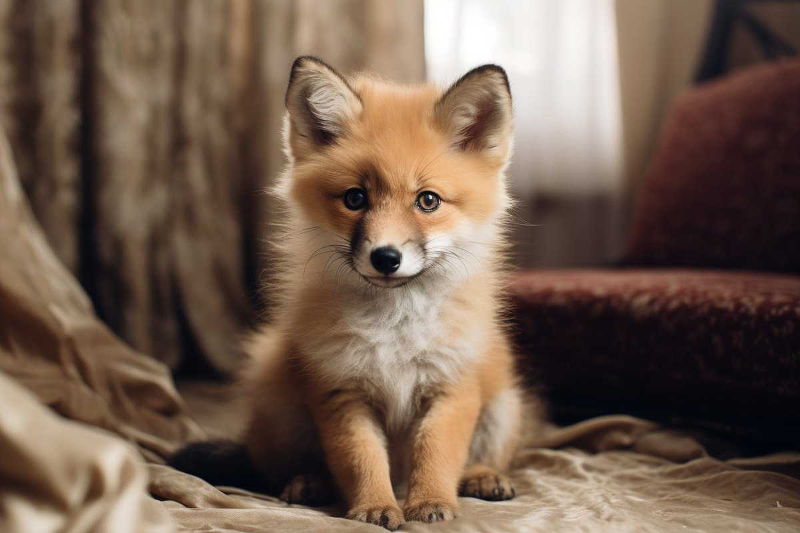

##

3 individual models that work together to solve a problem that was near impossible months ago.  

The example uses the following:  

• A Zero-Shot Object Detection model  
• A Segmentation model  
• A Diffusion model  

Let me show you:

We want to take an image and ask our application to replace an object in that image with something else.  

For example:  

• We show it an image of a fox.  
• And we tell it to replace the fox with a dog.  

The output should be the same image with a dog instead of a fox.  

