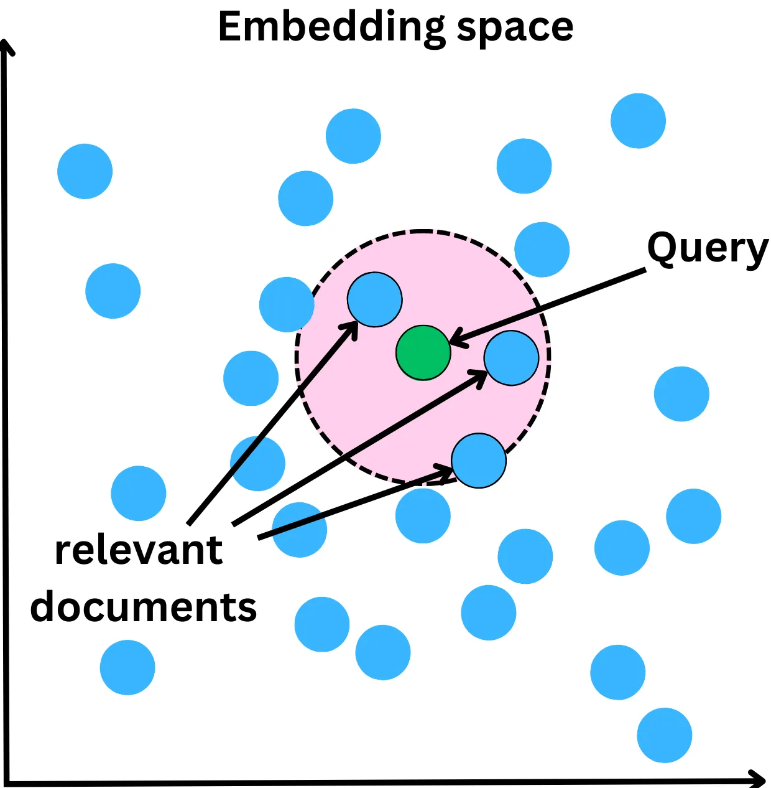

Source: https://newsletter.theaiedge.io/p/deep-dive-how-do-vector-databases

# Plongée en profondeur : Comment fonctionnent les bases de données vectorielles ?

Les bases de données vectorielles sont souvent utilisées dans les moteurs de recherche en utilisant les représentations vectorielles des éléments que nous essayons de rechercher. Nous examinerons les différents algorithmes qui nous permettent de rechercher des vecteurs parmi des milliards ou des trillions de documents. Dans cette publication, nous couvrons les sujets suivants :  

- Qu'est-ce qu'une base de données vectorielle ?
  - L'émergence des bases de données vectorielles
  - Différentes bases de données vectorielles
- Indexation et recherche dans un espace vectoriel
  - Quantification des produits
  - Hachage sensible à la localité
  - Petit monde hiérarchique navigable
- Mesures de similarité
  - Distance euclidienne
  - Produit en points
  - Similitude en cosinus
- Au-delà de l'indexation

## Qu'est-ce qu'une base de données vectorielle
### L'émergence des bases de données vectorielles

À l'ère de l'IA générative, les bases de données vectorielles se sont multipliées. L'idée derrière les bases de données vectorielles est d'indexer les données avec des vecteurs qui se rapportent à ces données.

Les bases de données vectorielles sont souvent utilisées pour les moteurs de recommandation où nous apprenons les représentations vectorielles des utilisateurs et des articles que nous voulons recommander.

Cela permet de trouver rapidement des articles similaires en utilisant une recherche approximative des voisins les plus proches.

Tant que nous pouvons apprendre une représentation vectorielle d'un élément de données, nous pouvons l'indexer dans une base de données vectorielle. Avec l'avènement récent des LLM (Large Language Model - Grand modèle de langage), il est devenu plus facile de calculer des représentations vectorielles de documents textuels capturant la signification sémantique de ce texte.

Les bases de données vectorielles facilitent la recherche de documents textuels sémantiquement similaires.

### Différentes bases de données vectorielles

Il existe des tonnes de fournisseurs de bases de données vectorielles. Voici une petite liste de ces bases de données :

- [Pinecone](https://www.pinecone.io/) : Une base de données vectorielle conçue pour les applications d'apprentissage automatique. Elle prend en charge une variété d'algorithmes d'apprentissage automatique et s'appuie sur [Faiss](https://faiss.ai/), une bibliothèque open source de Meta pour la recherche efficace de similarités dans des vecteurs denses.
  
- [Deep Lake](https://www.deeplake.ai/) : Deep Lake est une base de données pour l'IA alimentée par un format de stockage unique optimisé pour pour des applications basées sur l'apprentissage en profondeur (deep-learning) et les grands modèles de langage (LLM). Elle simplifie le déploiement de produits LLM d'entreprise en offrant un stockage pour tous les types de données (embeddings, audio, texte, vidéos, images, pdfs, annotations, etc.), des requêtes et des recherches vectorielles, des flux de données tout en entraînant des modèles à grande échelle, le versionnage et le lignage des données pour toutes les charges de calcul, et des intégrations avec des outils populaires tels que LangChain, LlamaIndex, Weights & Biases, et bien d'autres encore.

- [Milvus](https://milvus.io/) : Milvus est une base de données vectorielles open-source conçue pour alimenter les applications de recherche de similarité et d'intelligence artificielle. Milvus rend la recherche de données non structurées plus accessible et offre une expérience utilisateur cohérente quel que soit l'environnement de déploiement.

- [Qdrant](https://qdrant.tech/) : est un moteur de recherche de similarité vectorielle et une base de données vectorielle. Il fournit un service prêt à la production avec une API pratique pour stocker, rechercher et gérer des vecteurs ponctuels avec une charge utile supplémentaire. Qdrant est conçu pour un support de filtrage étendu. Cela le rend utile pour toutes sortes de réseaux neuronaux ou de correspondances sémantiques, de recherches par facettes et d'autres applications.

- [Weaviate](https://weaviate.io/) : Weaviate est une base de données vectorielle open source robuste, scalable, cloud-native et rapide. Avec Weaviate, vous pouvez transformer vos textes, images et autres en une base de données vectorielles consultable en utilisant des modèles ML de pointe.

## Indexation et recherche dans un espace vectoriel

L'indexation d'une base de données vectorielles est très différente de l'indexation de la plupart des bases de données. L'objectif d'une requête est de renvoyer les voisins les plus proches, mesurés par une métrique de similarité. La complexité temporelle typique de l'algorithme des K plus proches voisins est O(ND), où N est le nombre de vecteurs et D la dimension du vecteur. La complexité temporelle augmente avec le nombre d'éléments, ce qui rend impossible la construction d'une base de données évolutive et rapide. L'approche classique consiste à s'appuyer sur les algorithmes de plus proche voisin approximatif (ANN) pour accélérer la recherche.

Nous examinons ici trois algorithmes différents utilisés pour la recherche vectorielle : Quantification des produits, Hachage sensible à la localité et Petit monde hiérarchique navigable. Il s'agit d'algorithmes typiques utilisés dans la plupart des bases de données vectorielles. Ils sont susceptibles d'être utilisés de manière combinée pour optimiser la vitesse de recherche.
