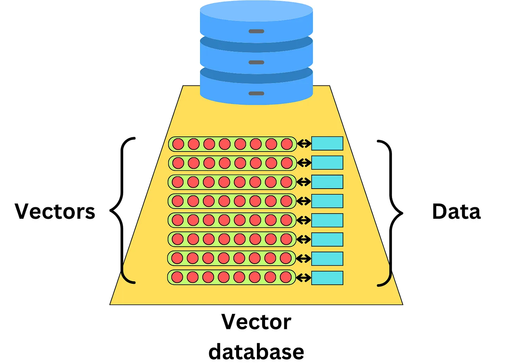
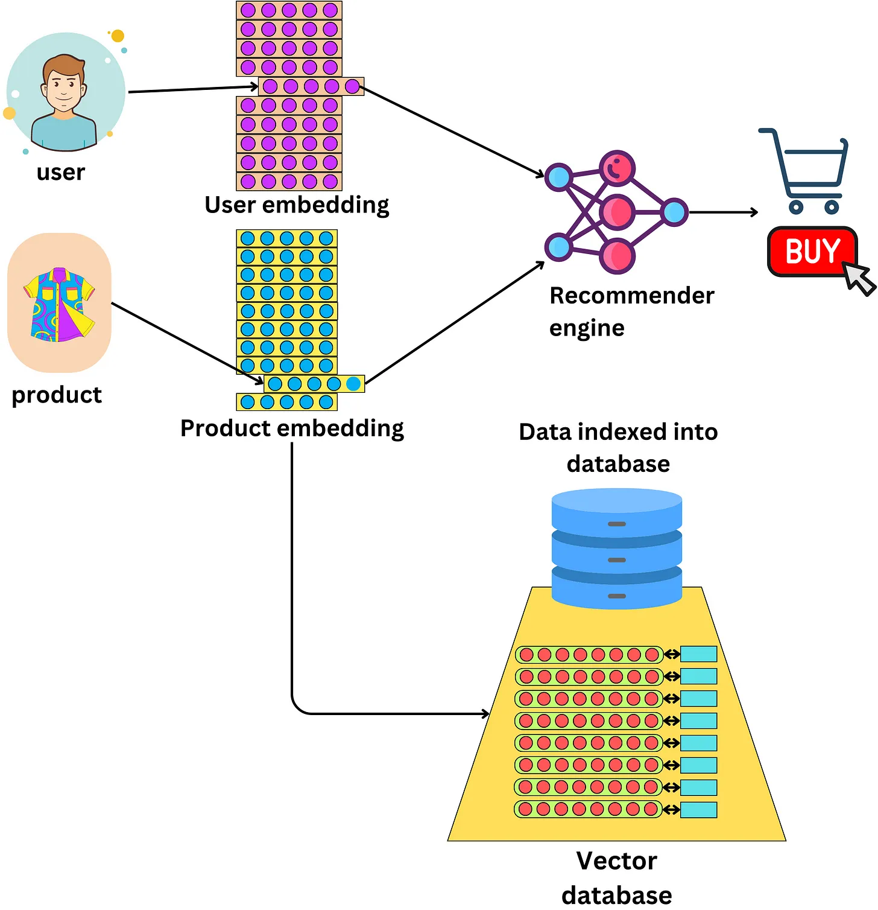
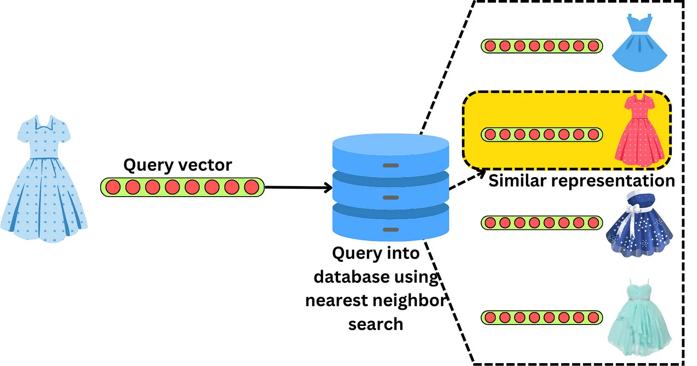
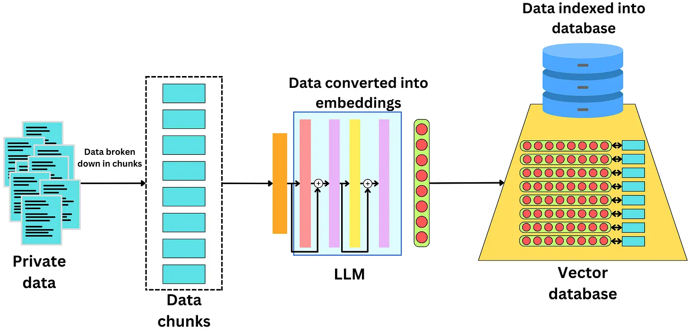

Source: https://newsletter.theaiedge.io/p/deep-dive-how-do-vector-databases

# Plongée en profondeur : Comment fonctionnent les bases de données vectorielles ?

Les bases de données vectorielles sont souvent utilisées dans les moteurs de recherche en utilisant les représentations vectorielles des éléments que nous essayons de rechercher. Nous examinerons les différents algorithmes qui nous permettent de rechercher des vecteurs parmi des milliards ou des trillions de documents. Dans cette publication, nous couvrons les sujets suivants :  

- Qu'est-ce qu'une base de données vectorielle ?
  - L'émergence des bases de données vectorielles
  - Différentes bases de données vectorielles
- Indexation et recherche dans un espace vectoriel
  - Quantification des produits
  - Hachage sensible à la localité
  - Petit monde hiérarchique navigable
- Mesures de similarité
  - Distance euclidienne
  - Produit en points
  - Similitude en cosinus
- Au-delà de l'indexation

## Qu'est-ce qu'une base de données vectorielle
### L'émergence des bases de données vectorielles

À l'ère de l'IA générative, les bases de données vectorielles se sont multipliées. L'idée derrière les bases de données vectorielles est d'indexer les données avec des vecteurs qui se rapportent à ces données.

Les bases de données vectorielles sont souvent utilisées pour les moteurs de recommandation où nous apprenons les représentations vectorielles des utilisateurs et des articles que nous voulons recommander.

Cela permet de trouver rapidement des articles similaires en utilisant une recherche approximative des voisins les plus proches.

Tant que nous pouvons apprendre une représentation vectorielle d'un élément de données, nous pouvons l'indexer dans une base de données vectorielle. Avec l'avènement récent des LLM (Large Language Model - Grand modèle de la langage), il est devenu plus facile de calculer des représentations vectorielles de documents textuels capturant la signification sémantique de ce texte.

Les bases de données vectorielles facilitent la recherche de documents textuels sémantiquement similaires.

